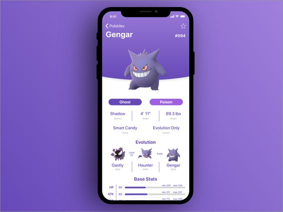
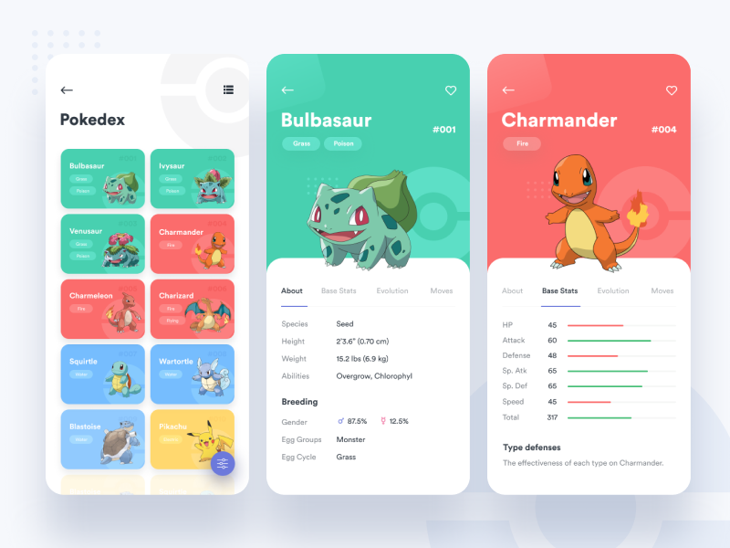
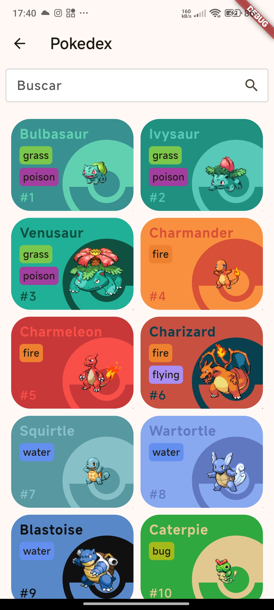
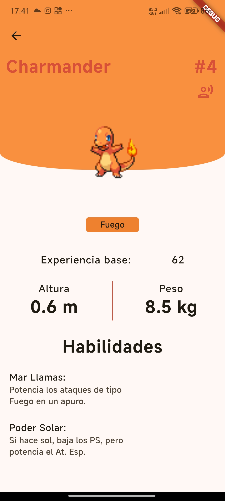
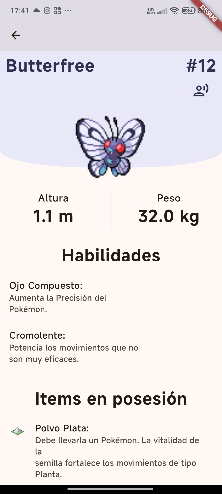

# Flutter UI/UX Design Replication Project

This Flutter project aims to replicate popular UI/UX designs found online. The goal is to explore and recreate modern, clean, and interactive interfaces using Flutter, focusing on enhancing both functionality and aesthetics. The project leverages various APIs and libraries to provide dynamic content and smooth user experiences.

## Features

- Clean and responsive design
- Modern UI components with animations
- Dynamic content integration using APIs
- Focus on user experience with intuitive navigation

## Current Designs

### 1. **Pokedex Page**

- **API**: [PokeAPI](https://pokeapi.co/)
- **Description**: A replica of a Pokedex page where users can browse a list of Pokémon, view details of each Pokémon, and search/filter through the database.
- **Technologies**:
  - Flutter
  - Dio for HTTP requests
  - State management using GetX
  - PokeAPI for fetching Pokémon data
- **Screenshots (Inspiration):**

  

  

- **Screenshots (Actual Design):**

  

  

  

  

## Future Additions

- More pages replicating famous app designs
- Enhanced UI elements such as animations and transitions
- Additional API integrations for dynamic content

Stay tuned as we continue to expand the list of designs!
