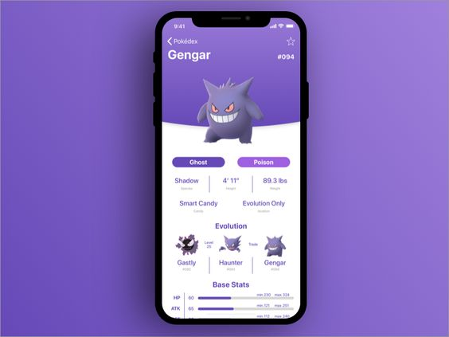
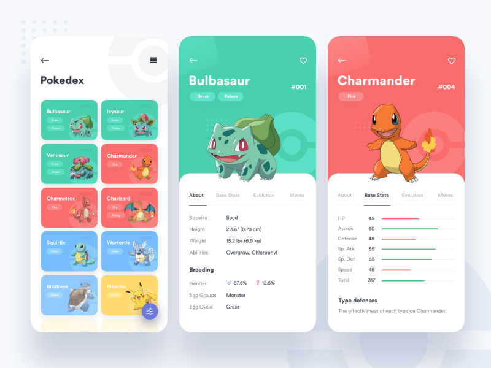
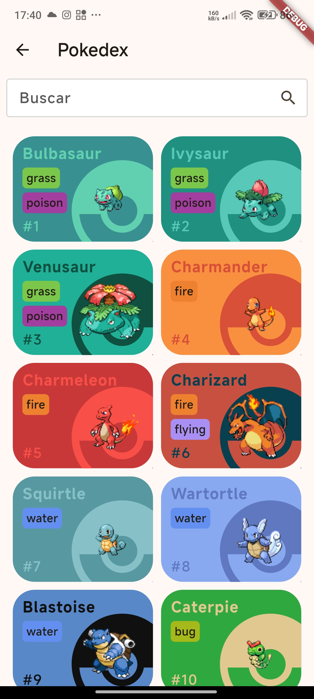
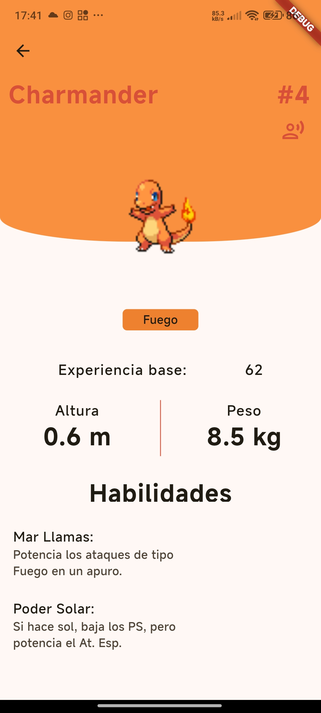
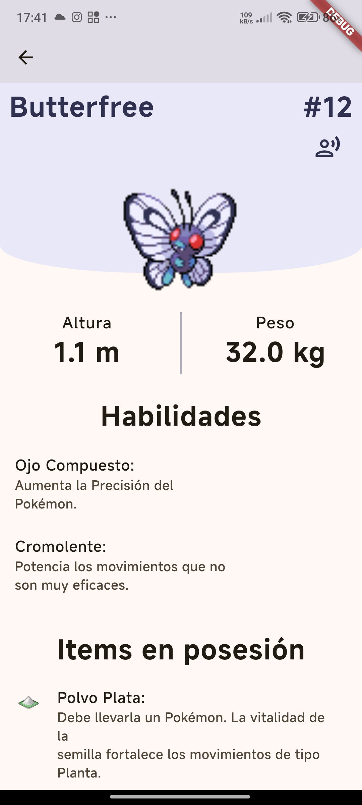
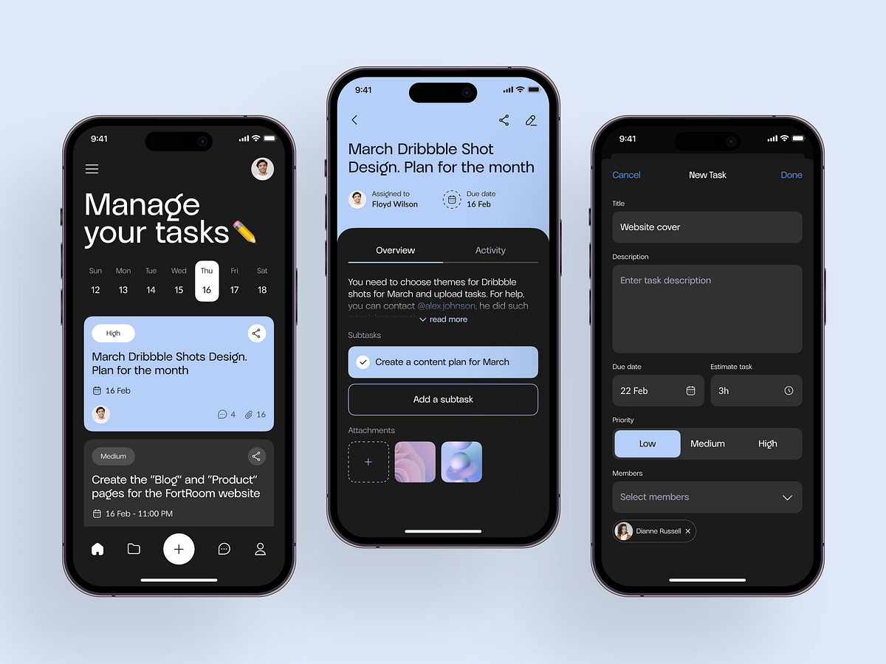
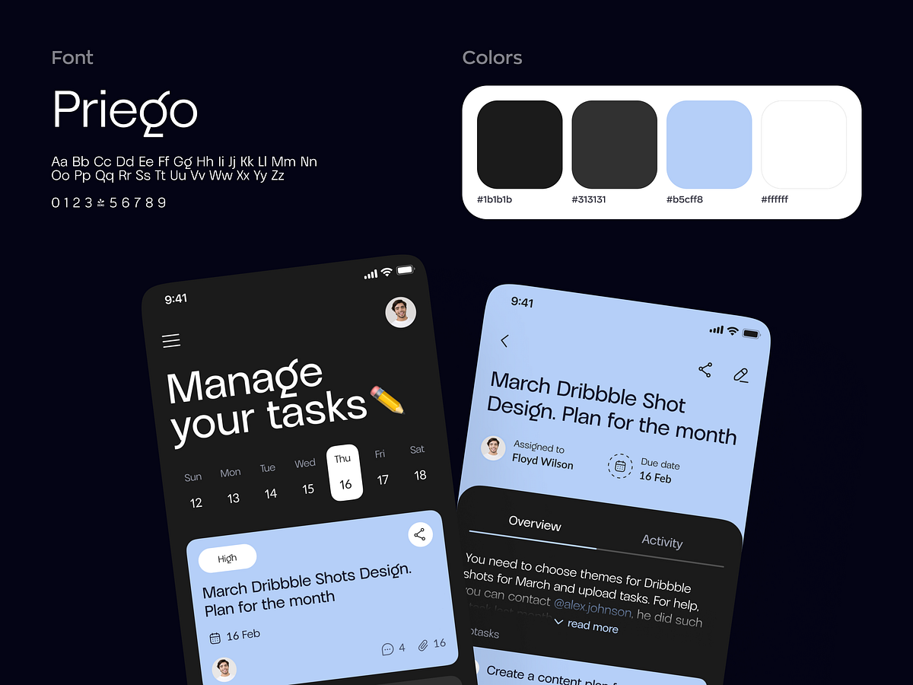

# Flutter UI/UX Design Replication Project

This Flutter project aims to replicate popular UI/UX designs found online. The goal is to explore and recreate modern, clean, and interactive interfaces using Flutter, focusing on enhancing both functionality and aesthetics. The project leverages various APIs and libraries to provide dynamic content and smooth user experiences.

## Features

- Clean and responsive design
- Modern UI components with animations
- Dynamic content integration using APIs
- Focus on user experience with intuitive navigation

## Current Designs

### 1. **Pokedex Page**

- **Description**: A replica of a Pokedex page where users can browse a list of Pokémon, view details of each Pokémon, and search/filter through the database.
- **Inspiration credit**: [Dribbble on Pinterest](https://www.pinterest.com/pin/1088463803668789121/), [Saepul Nahwan on Dribbble](https://dribbble.com/shots/6540871-Pokedex-App) 
- **Technologies**:
  - Dio for HTTP requests
  - State management using GetX
  - PokeAPI ([PokeAPI](https://pokeapi.co/)) for fetching Pokémon-related data
  - Pokemon 3rd party hosted service (pokemon-service-ucql.onrender.com) for Pokémon search
- **Screenshots (Inspiration):**

  

  

- **Screenshots (Actual Design):**

  

  

  

  

### 2. **Tasks Page**

- **Description**: A replica of a Tasks app (only replicating tasks CRUD page) by calendar with custom fonts and local storage support
- **Inspiration credit**: [Ronas IT | UI/UX Team on Dribbble](https://dribbble.com/shots/20767519-Task-Management-App-iOS-Android-UI)
- **Technologies**:
  - Local Storage using Drift/SQLite
  - State management using GetX
  - Custom font Bambino from [DaFont Free](https://www.dafontfree.io/bambino-font/) under the License: Free for Personal Use (I wanted to use Priego Custom Font - as per the original design -, but I only found demo versions of that font)

- **Screenshots (Inspiration):**

  

  

- **Screenshots (Actual Design):**

  

  

  

  

## Future Additions

- More pages replicating famous app designs
- Enhanced UI elements such as animations and transitions
- Additional API integrations for dynamic content

Stay tuned as we continue to expand the list of designs!

## Credits

The app icon is the greek letter Pi (representing the [numerical constant](https://en.wikipedia.org/wiki/Pi)) because this app is constantly renewing itself - and because I like it ☺:
<a target="_blank" href="https://icons8.com/icon/3533/pi">Pi</a> icon by <a target="_blank" href="https://icons8.com">Icons8</a>

